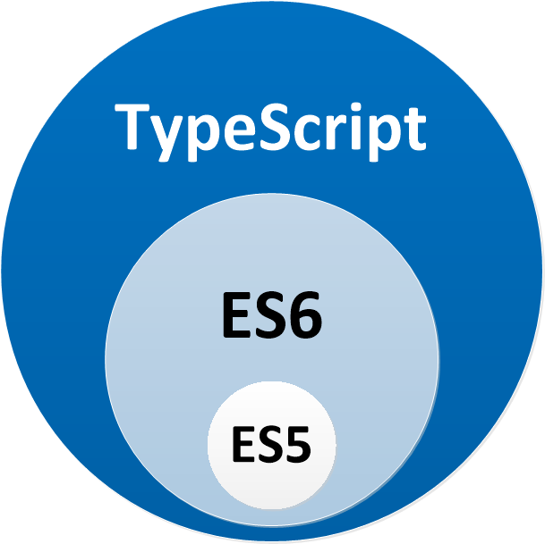
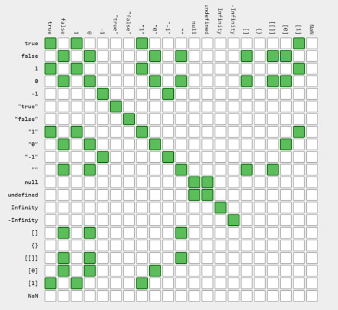
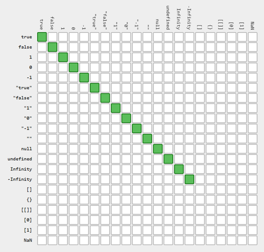
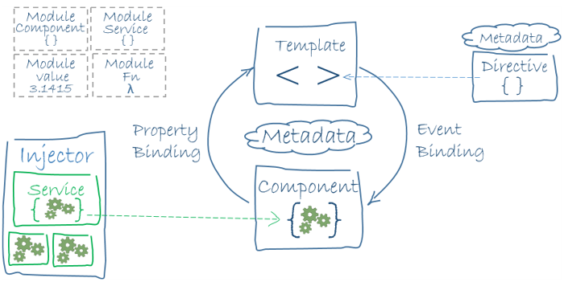
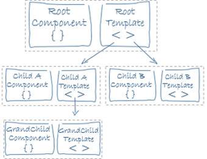
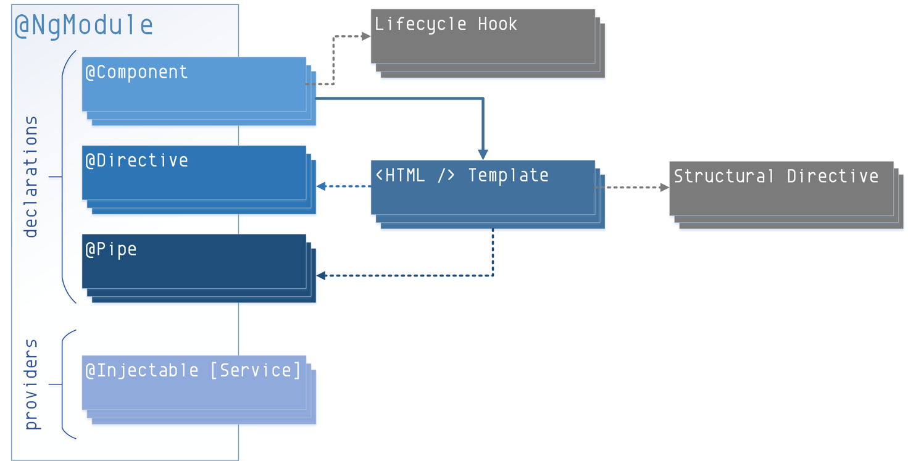
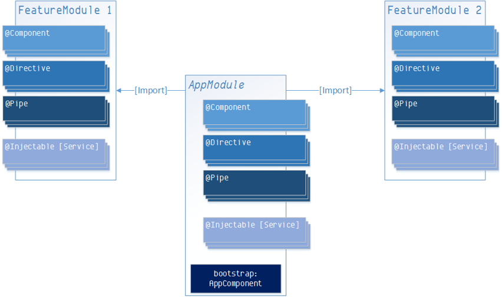

### bbv Workshop

## Webtechnologien

---

### Vor- und Nachteile von Web Applikationen

+++

#### Vorteile

- @fa[thumbs-up] Einfaches Deployment
- @fa[thumbs-up] Platformunabhägigkeit
- @fa[thumbs-up] Styling / Umsetzung von Corporate Identity (CI)
- @fa[thumbs-up] State-Of-The-Art

+++

#### Nachteile

- @fa[thumbs-down] Zugriff auf Hardware Resourcen nicht möglich
- @fa[thumbs-down] Neuer Technologie Stack (Lernaufwand)
- @fa[thumbs-down] Nur WepAPI/Json als Kommunikationsprotokoll
- @fa[thumbs-down] Browser-Unterstützung

---

### Uni- und bidirektionale Kommunikation

- WebAPI mit HTTP Verben (REST) => Unidirektional by Default
- Server Callback via SignalR (WebSockets)

+++

#### Web API

```csharp
[Authorize]
public class DeviceController : ApiController
{
  private static readonly List<Device> = new List<Device>()
  {
    new Device("Device1", "KarlFischer1.jpg"),
    new Device("Device2", "KarlFischer2.jpg"),
    new Device("Device3", "KarlFischer3.jpg"),
  };

  [HttpGet]
  [Route("api/v1/devices")]
  public Task<HttpResponseMessage> GetAll()
  {
    var response = this.Request.CreateRespone(HttpStatusCode.OK, Devices);
    return Task.FromResult(response);
  }
}
```

+++

#### Angular Service

```typescript
import { Injectable } from "@angular/core";
import { HttpClient } from "@angular/common/http";

import { Observable } from "rxjs/Observable";

import { Device } from "../device.model";

@Injectable()
export class DeviceService {
  constructor(private http: HttpClient) {}

  getAll(): Observable<Device[]> {
    const url = "http://localhost:8080/api/v1/devices";
    return this.http.get<Device[]>(url);
  }
}
```

+++

#### Angular Component

```typescript
import { Component, OnInit } from '@angular/core';

import { Observable } from 'rxjs/Observable';

import { Device } from '../device.model';
import { DeviceService } from './device.service';

@Component({
  selector: 'omnis-devices',
  templateUrl: './devices.component.html'
  styleUrls: ['./devices.component.css']
})
export class DevicesComponent implements OnInit {
  devices$: Observable<Device[]>;

  constructor(private service: DeviceService) {}

  ngOnInit() {
    this.devices$ = this.service.getAll();
  }
}
```

+++

#### Angular Template

```html
<mat-card *ngFor="let device of devices | async">
  <mat-card-title>{{ device.deviceName }}</mat-card-title>
  
</mat-card>
```

+++

#### DeviceHub

```csharp
public class DeviceHub : Hub
{
  private static readonly IHubContext HubContext =
    GlobalHost.ConnectionManager.GetHubContext<DeviceHub>();

  public static void ReportStatus(
    string deviceName,
    string connectionState)
  {
    HubContext.Clients.Group(deviceName)
      .HeartBeat(new HeartBeat(deviceName, connectionState));
  }

  public void Register(string deviceName)
  {
    HubContext.Groups.Add(
      this.Context.ConnectionId,
      deviceName
    );
  }
}
```

+++

#### Angular Component

```typescript
export class DeviceComponent implements OnInit {
  @Input()
  device: Device;

  private connection: ISignalRConnection;
  private heartBeat$: BroadcastEventListener<HeartBeat>;

  constructor(private signalR: SignalR) {}

  ngOnInit() {
    this.signalR.connect().then(connection => {
      this.connection = connection;
      this.heartBeat$ = new BroadcastEventListener<HeartBeat>("HeartBeat");

      this.connection.invoke("Register", this.device.deviceName);
      this.connection.listen(this.heartBeat$);

      this.heartBeat$.subscribe(hb => {
        this.device.state = hb.ConnectionState;
      });
    });
  }
}
```

---

### Interoperatibilität zwischen verschiedenen Programmiersprachen

+++

#### JavaScript vs. TypeScript

@div[left-50]
<br>

@divend

@div[right-50]
<br><br><br>
@ul

- Extend JavaScript for writing large apps (superset of JavaScript)
- Adds support for classes, interfaces & modules
- Development tooling support
- Transpiles to JavaScript
  @ulend
  @divend

+++

#### TypeScript vs. C

- Umstieg von C# nach TypeScript relativ leicht
- Ähnliche Syntax

+++

#### WebAPI

- HTTP-Verben: GET, PUT, POST, DELETE
- REST (Representational state transfer)

+++

#### Json

- Kontrakt-Basierte Kommunikation
- Modelle zwischen Client & Server müssen synchron gehalten werden

---

### Server-Side vs. Client-Side Rendering

- **Client Side Technologies**

  - HTML, CSS, JavaScript
  - JQuery, Ajax
  - Flash, Silverlight

- **Server Side Technologies**
  - ASP, PHP, Perl, JSP
  - ASP.NET, Java

+++?image=assets/SinglePageApplication.png&size=auto 80%

---

### Technologie-Stacks

- Node.js
- npm (Node Package Manager)
- Angular CLI
- Visual Studio Code
- Cypress (e2e Testing)

- ASP.NET WebAPI2 (Owin)
- .NET Core Web API

---

## JavaScript

+++

### Why JavaScript?

- JavaScript is the programming language of the web and more!
  - Web Applications
  - Cross-Platform applications (Mobile & Desktop)
  - Server-Side applications (node.js)
- Leverages web sites to be interactive
- Leverages user experience
- Makes web apps feel like desktop apps
- Building block for Web 2.0

+++

### JavaScript: The basics

- Dynamische Typisierung mit sieben Typen
- Funktionen als "First-Class-Objekte" für die funktionale Programmierung
- Async Programming (Promises)
- Prototypische Objektorientierung

+++

### JavaScript: Data Types and Values

- Primitive Types
  - `string`
  - `number`
  - `boolean`
- Special Types
  - `null`
  - `undefined`
- Object
  - Arrays, funktions and regular expressions
- New in ES6
  - `symbol`

+++

### JavaScript: Strings

```javascript
"a string";
"another string";

"Hello" + " World"; // 'Hello World'
"Hello ".concat("World"); // 'Hello World'

"Hello World".substring(6); // 'World'
"Hello World".substring(0, 5); // 'Hello'
```

+++

### JavaScript: Numbers

```javascript
34 === 34.0; // true
123e-5; // 0.00123
0xff; // 255

0.1 + 0.2; // 0.30000000000000004
(0.2 * 10 + 0.1 * 10) / 10; // 0.3

var number = 42;
number.toString(); // '42'
number.toString(2); // '101010'

42 * "party"; // NaN
```

+++

### JavaScript: Comparison [==/!=]



+++

### JavaScript: Comparison [===/!==]



+++

### JavaScript: Functions

```javascript
function multiply(x, y) {
  return x * y;
} // without ;

var add = function(x, y) {
  return x + y;
}; // with ;

add(1, 2, 3); // 3
add(); // NaN

function countArgs() {
  console.log(arguments.length);
}
countArgs(1, 2, 3, 4); // returns undefined, logs 4
```

---

## TypeScript

+++

### Why TypeScript?

- TypeScript is a language for application-scale JavaScript development
- TypeScript is a typed superset of JavaScript that compiles to plain JavaScript
- Any browser. Any host. Any OS. Open Source.
  <br><br>
  > typescriptlang.org

+++

### TypeScript: Design Goals

@div[left-50]
<br>

@divend

@div[right-50]
<br><br><br>
@ul

- Extend JavaScript for writing large apps (superset of JavaScript)
- Adds support for classes, interfaces & modules
- Development tooling support
- Transpiles to JavaScript
  @ulend
  @divend

+++

### TypeScript: Tooling Support

- Static type checking
- Strong type inference
- Symbol-based navigation
- Statement completion / intellisense
- Code refactoring
- Editors:
  - Visual Studio (since 2015)
  - Visual Studio Code
  - Jetbrains Webstorm
  - Atom

+++

### TypeScript: Types

- All types are subtypes of a single top type called the `Any` type
- Represents any JavaScript value with no constraints
- Primitive Types
  - `number`
  - `bool`
  - `string`
  - `null`
  - `undefined`
- Object Types
  - Class, module, interface and literal types
  - Supports typed arrays: `var reports: Employee[] = []`

+++

### TypeScript: Arrow Function Expressions

- New feature in ECMAScript 6
- Compact form of function expressions that omit the `function` keyword
- Similar to lamda expressions in C#
- Lexical scoping of `this`

```typescript
let messenger = {
  message: "Hello World",
  start: function() {
    setTimeout(() => {
      alert(this.message);
    }, 3000);
  }
};

messenger.start();
```

+++

### TypeScript: Classes

- Support for ECMAScript 6 alike classes
- Methods are translated into JavaScript prototype chain
- `public` and `private` member accessability
- Parameter property declarations via constructor
- Supports single-parent inheritance
- Derived classes make use of `super` calls to parent

+++

### TypeScript: Classes

```typescript
class Animal {
  constructor(private name) {}
  move(meters) {
    alert(this.name + " moved " + meters + "m.");
  }
}

class Snake extends Animal {
  move() {
    alert("Slithering…");
    super.move(5);
  }
}

class Horse extends Animal {
  move() {
    alert("Galloping…");
    super.move(45);
  }
}
```

+++

### TypeScript: Interfaces

- Designed for development tooling support only
- No output when compiled to JavaScript
- Supports overload by parameter signature
- Supports implementing multiple interfaces

+++

### TypeScript: Interfaces

```typescript
interface Drivable {
  start(): void;
  drive(distance: number) void;
  getPosition(): number;
}

class Car implements Drivable {
  private isRunning: bool = false;
  private distanceFromStart: number;

  public start(): void {
    this.isRunning = true;
  }

  public drive(distance: number): void {
    if (this.isRunning) {
      this.distanceFromStart += distance;
    }
  }

  public getPosition(): number {
    return this.distanceFromStart;
  }
}
```

+++

### TypeScript: Structural Types

```typescript
interface Person {
  firstName: string;
  lastName: string;
}

function greeter(person: Person) {
  return "Hello, " + person.firstName + " " + person.lastName;
}

const user = { firstName: "John", lastName: "Doe" };

greeter(user);
```

+++

### TypeScript: Modules

- Analogous to .NET namespace
- Prevents global variable naming collisions
- Closely aligned with modules from ECMAScript 6
- Accessibility for internal and external modules
- Allows exposing a public API

+++

### TypeScript: Source File Dependencies

```typescript
export interface Data {
  id: number;
  name: string;
}
```

```typescript
import { HttpClient } from '@angular/common/http';
import { Observable } from 'rxjs/Observable';
import { Data } from './data.model';

export class DataService {
  constructor(private http: HttpClient) { }

  getAll(): Observable<Data[]> {
    ...
  }
}
```

+++

### TypeScript: SourceMap Support

- Alleviates the debugging issues that are raised by `tsc` and JavaScript minifiers
- You aren't debugging the code that you wrote
- SourceMaps fixes this; it works like magic!
- A way to map transpiled / minified files back to their unbuilt state
- Allows debugging and having breakpoints from `.ts` files

+++

### TypeScript: Code Quality

- Frontend code is as valuable as backend code!
- Needs formal correctnes
- Should be tested

---

## Angular

+++

### What is Angular?

- Evolution of AngularJs
- Framework by definition
- Built and maintained by Google
- OpenSource, huge community
- Release Schedule: 1 major version per 6 months
- Committed to semver

+++

### Angular: Tooling

- Angular CLI (https://cli.angular.io/)
- Angular Console (https://angularconsole.com/)
- Yarn Package Manager (https://yarnpkg.com/lang/en/)

Use Angular CLI with Yarn:

`ng config -g cli.packageManager yarn`

+++

### Angular: Tooling

**Visual Studio Code**

- Angular Language Service
- Debugger for Chrome
- EditorConfig for VS Code
- Prettier - Code formatter
- TSLint

**Chrome**

- Augury

+++

### Angular: Benefits

- Multi-Platform
  - Web (IE, Chrome, Firefox, …)
  - Mobile (Ionic, NativeScript)
  - Desktop (Electron)
- Speed & Performance
  - Code Generation (JIT & AOT)
  - Lazy Loading
  - Tree Shaking
- Productivity (Angular-CLI, Code-Templates)
- Testability
- Internationalization (i18n)

+++

### Angular: Architecture



+++

### Angular: Architecture



+++

### Angular: Building Blocks (Overview)

- Modules (Organize your application)
- Components (Create your own HTML elements)
- Lifecycle Hooks (Control the lifetime of your components)
- Attribute directives (Change appearance or behavior of an element)
- Structural Directives (NgIf, NgSwitch, NgFor)
- Pipes (Format your data)
- Services (Separate your business logic out of your components)
  <br><br>
- HTTP Client
- Routing & Navigation
- Forms
- Animations
- Dependency Injection

+++

### Angular: Building Blocks (Modules)



+++

### Angular: Building Blocks (Modules)

```typescript
import { NgModule } from "@angular/core";
import { BrowserModule } from "@angular/platform-browser";

import { AppComponent } from "./app.component";
import { MyDirective } from "./app.directive";
import { MyPipe } from "./app.pipe";
import { MyService } from "./app.service";

@NgModule({
  imports: [BrowserModule],
  declarations: [AppComponent, MyDirective, MyPipe],
  providers: [MyService],
  bootstrap: [AppComponent]
})
export class AppModule {}
```

+++

### Angular: Building Blocks (Modules)



+++

### Angular: Building Blocks (Component)

```typescript
import { Component } from '@angular/core';

@Component({
  selector: 'my-app',
  templateUrl: './app.component.html'
  styleUrls: ['./app.component.css']
})
export class AppComponent { }
```

+++

### Angular Building Blocks (Service)

```typescript
import { Injectable } from "@angular/core";
import { HttpClient } from "@angular/common/http";

import { Observable } from "rxjs/Observable";

import { Todo } from "./todo.model";

@Injectable()
export class TodoService {
  constructor(private http: HttpClient) {}

  getAll(): Observable<Todo[]> {
    const url = "http://localhost:8080/api/todos";
    return this.http.get<Todo[]>(url);
  }
}
```

+++

### Angular Building Blocks (Pipe)

```typescript
import { Pipe, PipeTransform } from "@angular/core";

import { Todo } from "./todo.model";

@Pipe({ name: "prettify" })
export class TodoPipe implements PipeTransform {
  transform(todo: Todo): string {
    return `${todo.task} (${todo.description})`;
  }
}

<p>{todo | prettify}</p>;
```

+++

### Angular: Project Organisation

- Include as much as possible in a feature module
- Try to make feature module as self-contained as possible
- Keep folder structure and modules in sync
  <br><br>
- Special module: `SharedModule` (`shared.module.ts`)

  Include components, pipes, directives and other modules that are shared across the application (typically imported by feature modules)

+++

### Angular: Best Practices

- Fix linting warnings as soon as possible
- Do code reviews
- Run tests / make them pass before checking in
- Establish continuous integration
- Keep the same order within the import statements across all your files
  - Angular imports
  - 3rd Party imports (e.g. rxjs)
  - Your own classes

+++

### Angular: Best Practices

- Follow the coding guidelines (https://angular.io/guide/styleguide)
- Look for a basic Mockup/Layout of your application. This helps identify modules and the component tree.
- Use code generation strategies (VSCode Templates, Angular-CLI)

---

## Resources (Client-Side vs. Server-Side)

- Client-side vs. server-side rendering: why it’s not all black and white (https://medium.freecodecamp.org/what-exactly-is-client-side-rendering-and-hows-it-different-from-server-side-rendering-bd5c786b340d)

+++

## Resources (ASP.NET SignalR)

- Microsoft Docs (https://docs.microsoft.com/en-us/aspnet/signalr/index)
- Microsoft Landing Page (https://docs.microsoft.com/en-us/aspnet/signalr/index)
- Angular Client (https://github.com/HNeukermans/ng2-signalr)

+++

## Resources (Angular)

- Angular Docs (https://angular.io/docs)
- Angular In Depth (https://blog.angularindepth.com/)
- Reddit: Angular (2+) (https://www.reddit.com/r/Angular2/)
- Angular Switzerland (https://swissangular.com/)
